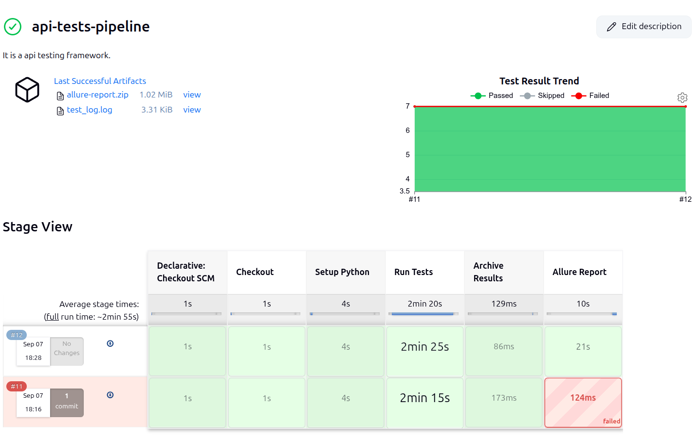
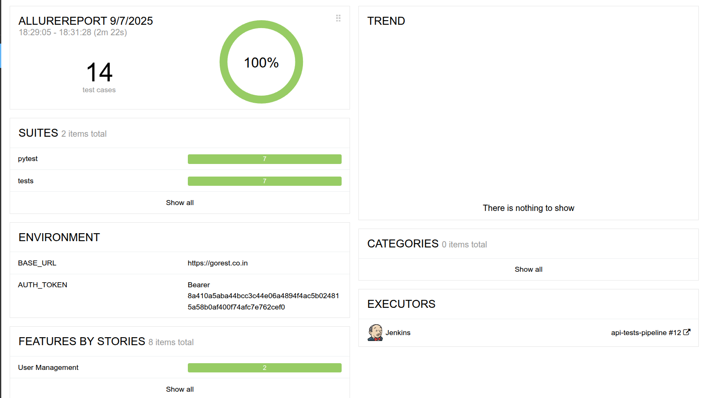
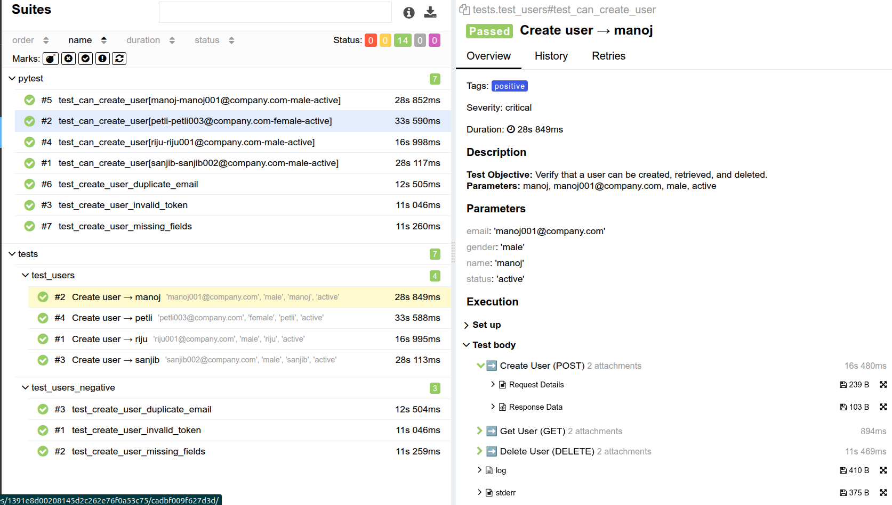
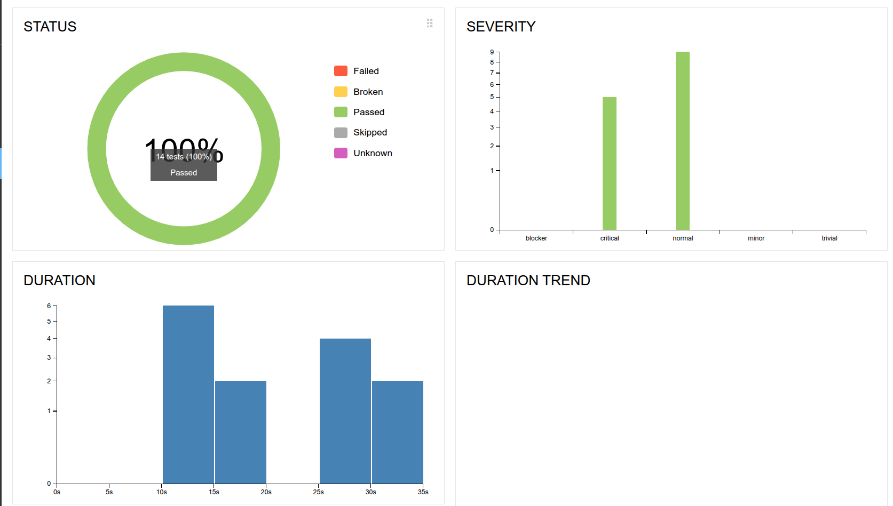

<p align="center">
  
  
  
  
  
</p>

# API Test Automation Framework (Pytest + Jenkins + Allure)

This project is a **REST API Test Automation Framework** built with **Python, Pytest, and Requests**, fully integrated with **Jenkins CI/CD** and **Allure Reporting**.  
It is designed to be **scalable, maintainable, and CI/CD-ready** for professional API testing projects.

---

## Table of Contents
- [Features](#-features)
- [Quick Start](#-quick-start)
- [Project Structure](#-project-structure)
- [Setup Instructions](#-setup-instructions)
- [Jenkins Pipeline](#-jenkins-pipeline-setup)
- [Allure Reports](#-allure-reports)
- [Tech Stack](#-tech-stack)
- [Screenshots](#-screenshots)
  - [Jenkins Pipeline Stages](#jenkins-pipeline-stages)
  - [Allure Report Dashboard](#allure-report-dashboard)
  - [Test Results Summary](#test-results-summary)

---

### 📷 Screenshots

#### Jenkins Pipeline Stages  


#### Allure Report Dashboard  


#### Test Results Summary  


---

## ✅ Features
- **Test Framework:** Built on [Pytest](https://docs.pytest.org/) (simple, powerful, extensible).  
- **HTTP Requests:** Uses Python [requests](https://docs.python-requests.org/) for REST API calls.  
- **Schema Validation:** JSON Schema validation using [jsonschema](https://pypi.org/project/jsonschema/).  
- **Data-Driven Testing:** External test data managed via Excel ([openpyxl](https://openpyxl.readthedocs.io/)).  
- **CI/CD Integration:** Automated pipeline via **Jenkins** with GitHub integration.  
- **Test Reports:** Rich **Allure Reports** + **JUnit XML test results**.  
- **Scalable Structure:** Organized modules for utilities, schemas, tests, and reports.  

---

## ⚡ Quick Start

### 1️⃣ Clone the Repository
```bash
git clone https://github.com/rijukrroy/pytest-api-automation-framework.git
cd pytest-api-automation-framework
```
### 2️⃣ Create Virtual Environment
```
python3 -m venv venv
source venv/bin/activate     # On Linux/Mac
venv\Scripts\activate        # On Windows
```
### 3️⃣ Install Dependencies
```
pip install -r requirements.txt
```
### 4️⃣ Run Tests
```
pytest -v --alluredir=reports/
```
### 5️⃣ Generate Allure Report
```
# Serve report in browser
allure serve reports/

# OR generate static HTML files
allure generate reports/ -o allure-report --clean
```
### 6️⃣ View Reports

Dynamic Report: 

        allure serve reports/

Static Report: 

        Open allure-report/index.html in browser

### 📂 Project Structure
```
project-root/
├── libraries/        # Utility modules (helpers, custom functions, etc.)
│   └── util.py
├── tests/            # Test cases organized by feature/module
│   ├── test_users.py
│   ├── test_posts.py
│   └── ...
├── reports/          # Allure raw results (generated after test run)
├── allure-report/    # Static HTML report (generated by Allure)
├── docs/             # Documentation assets (screenshots, diagrams, etc.)
│   ├── allure_overview.png
│   ├── allure_suites.png
│   ├── allure_trends.png
│   └── Stage_view.png
├── requirements.txt  # Python dependencies
├── README.md         # Project documentation
└── conftest.py       # Pytest fixtures (setup/teardown)
```
## ⚙️ Setup Instructions

### Run Locally
```
pytest --alluredir=allure-results --junitxml=allure-results/junit-results.xml
```
## 🏗 Jenkins Pipeline Setup
Open Jenkins → New Item → Pipeline.
```

Connect GitHub repo:

Repository URL: https://github.com/rijukrroy/pytest-api-automation-framework.git

Branch: main

Jenkins automatically detects the Jenkinsfile.
```
### Pipeline stages:

✅ Checkout code

✅ Setup Python virtual environment

✅ Install dependencies

✅ Run tests with Pytest

✅ Archive results (JUnit XML)

✅ Generate & publish Allure Report

### 📊 Allure Reporting
### Local Machine:
```
allure serve allure-results
```
### In Jenkins
```
Allure report is generated automatically in the pipeline.

View the report from Jenkins job → Build Artifacts → Allure Report.
```
### 🛠 Tech Stack
```
Language: Python 3.12

Test Framework: Pytest

HTTP Client: Requests

Validation: JSONSchema

Reporting: Allure, JUnit XML

CI/CD: Jenkins Pipeline (Groovy, Declarative)
```
### 📷 Screenshots

- **Jenkins Pipeline Stages**  
  

- **Allure Report Dashboard**  
  

- **Test Results Summary**  
  

## 📊 Allure Reports

Below are sample reports generated using **Allure** for this project:

### Overview


### Test Suites


### Trends


### Jenkins Stage View

